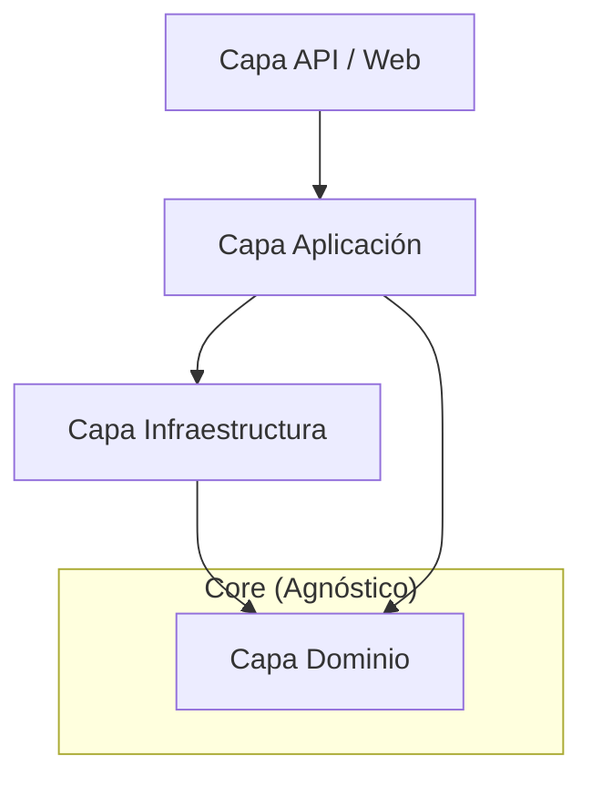
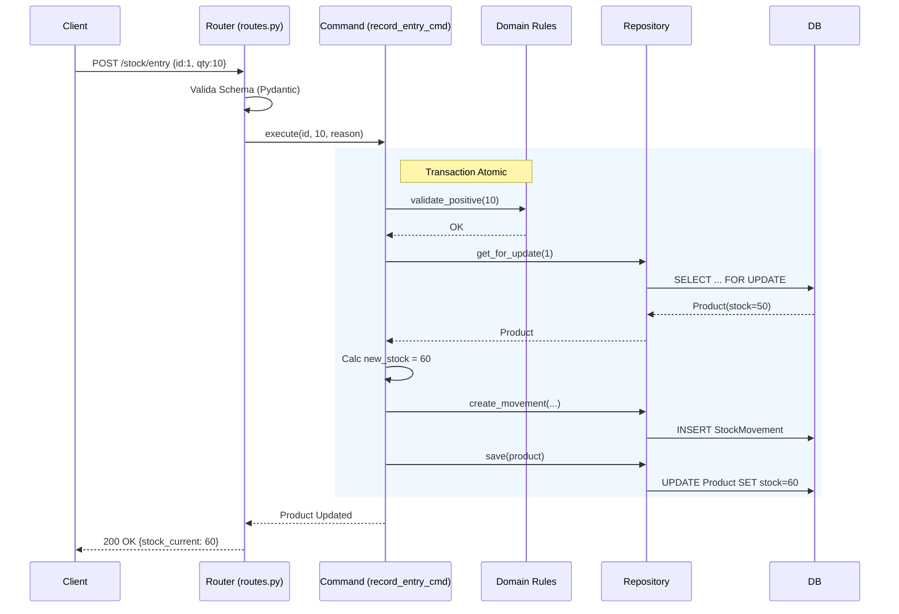

# Documentación de Arquitectura

**Estado:** V1 (Activo)  
**Fecha:** 2026-01-02  

Esta documentación detalla la arquitectura técnica del sistema de inventario, las decisiones de diseño, la estructura de directorios y los patrones implementados.

---

## 1. Filosofía Arquitectónica

El proyecto sigue una arquitectura **Clean Architecture (Arquitectura Limpia)** simplificada, combinada con principios de **Domain-Driven Design (DDD)** y **CQRS (Command Query Responsibility Segregation)**.

### Principios Clave
1.  **Separación de Responsabilidades:** Cada módulo tiene una función única. La lógica de negocio no sabe de HTTP, y la API no sabe de reglas de validación de stock.
2.  **Independencia del Framework:** La lógica de negocio (`domain`) es Python puro y no depende de Django ni de bases de datos.
3.  **Inmutabilidad del Stock:** El inventario no es un simple número editable; es el resultado de una suma de movimientos inmutables.
4.  **CQRS (Segregación de Comandos y Consultas):**
    *   **Commands (Escritura):** Modifican el estado, son transaccionales y estrictos.
    *   **Queries (Lectura):** Optimizadas para velocidad, pueden saltarse reglas de dominio complejas para leer datos directos para la UI.

---

## 2. Estructura de Carpetas

La organización jerárquica refleja las capas de la arquitectura. A continuación se detalla la estructura del módulo principal `inventory`.

```text
core/src/inventory/
├── domain/               # [CAPA 1] Reglas de Negocio Puras
│   ├── rules.py          # Validaciones (ej. stock no negativo)
│   ├── errors.py         # Excepciones de negocio
│   └── movement_types.py # Constantes y Enums
│
├── application/          # [CAPA 2] Casos de Uso
│   ├── commands/         # Acciones que cambian estado (Writes)
│   │   ├── record_entry_cmd.py
│   │   └── ...
│   └── queries/          # Consultas de datos (Reads)
│       ├── list_products_q.py
│       └── dashboard/
│
├── infrastructure/       # [CAPA 3] Adaptadores de Salida (DB)
│   ├── orm/              # Implementación con Django ORM
│   │   ├── models.py     # Definición de Tablas
│   │   ├── product_repo.py
│   │   └── ...
│   └── db/               # Utilidades de DB
│
├── api/                  # [CAPA 4] Adaptadores de Entrada (HTTP)
│   ├── routes.py         # Endpoints (Django Ninja)
│   └── auth/             # Autenticación JWT
│
└── schemas/              # Contratos de Datos (DTOs)
    ├── product_schemas.py
    └── stock_schemas.py
```

### Lógica de Organización
*   **De adentro hacia afuera:** `domain` no importa nada de afuera. `application` importa `domain`. `infrastructure` y `api` importan `application` y `domain`.
*   **Módulos autocontenidos:** Cada carpeta en `core/src` (ej. `inventory`, `contact`) es un *Bounded Context* separado.

---

## 3. Documentación de Componentes y Archivos

### 3.1. Capa de Dominio (`domain/`)
Es el corazón del software. Define *qué* hace el negocio, no *cómo*.
*   **`rules.py`**: Contiene funciones puras que validan lógica.
    *   *Ejemplo:* `validate_positive(quantity)` lanza error si la cantidad es <= 0.
    *   *Dependencias:* Ninguna externa. Solo tipos básicos de Python.
*   **`errors.py`**: Excepciones semánticas (`InvalidQuantity`, `NegativeStockNotAllowed`) que la API captura para dar respuestas 400/422 limpias.

### 3.2. Capa de Aplicación (`application/`)
Orquesta la lógica. Conecta el mundo exterior con el dominio.
*   **Commands (`commands/*_cmd.py`)**:
    *   *Función:* Ejecutar una acción de negocio completa.
    *   *Patrón:* Función `execute(...)`.
    *   *Responsabilidad:* Iniciar transacción DB, llamar validaciones de dominio, persistir cambios vía repositorios, emitir logs.
*   **Queries (`queries/*_q.py`)**:
    *   *Función:* Obtener datos para mostrar.
    *   *Patrón:* Función `execute(...)` que retorna dicts o DTOs.
    *   *Responsabilidad:* Construir queries eficientes (SQL optimizado, agregaciones).

### 3.3. Capa de Infraestructura (`infrastructure/`)
Implementa los detalles técnicos (Base de Datos).
*   **Modelos (`orm/models.py`)**: Clases `django.db.models.Model`. Son la representación SQL.
*   **Repositorios (`orm/*_repo.py`)**:
    *   *Función:* Abstraer el ORM de Django.
    *   *Ejemplo:* `product_repo.get_for_update(id)` bloquea la fila para evitar condiciones de carrera.

### 3.4. Capa de Presentación / API (`api/` y `schemas/`)
Maneja la comunicación HTTP.
*   **Schemas (`schemas/*.py`)**: Clases `Pydantic` que definen qué JSON entra y sale. Validan tipos automáticamente.
*   **Rutas (`routes.py`)**:
    *   *Función:* Definir endpoints URL (GET, POST).
    *   *Responsabilidad:* Recibir request, validar token, llamar al Command/Query adecuado y serializar la respuesta. No debe tener lógica de negocio ("Controller sutil").

---

## 4. Diagramas de Arquitectura

### 4.1. Flujo de Dependencias (The Dependency Rule)
Las flechas indican "conoce a" o "importa de".


*Nota: En una arquitectura pura, Application define interfaces que Infraestructura implementa (Inversión de Dependencia). En esta versión simplificada (Pragmática), Application importa Repositorios de Infraestructura directamente para reducir complejidad.*

### 4.2. Flujo de Datos: Creación de Entrada de Stock
Secuencia de un POST `/api/inventory/stock/entry`.



---

## 5. Guía de Estilo Arquitectónico

### Convenciones de Nomenclatura
*   **Archivos:** `snake_case` con sufijos descriptivos.
    *   `_cmd.py` para Comandos.
    *   `_q.py` para Queries.
    *   `_repo.py` para Repositorios.
*   **Funciones Principales:** Los módulos de servicio exponen una única función pública `execute(...)` para mantener la interfaz simple.
*   **Variables:**
    *   `qs`: QuerySet de Django.
    *   `dto`: Data Transfer Object.

### Buenas Prácticas Implementadas
1.  **Atomicidad Explícita:** Cualquier operación que toque más de una tabla (o lea y escriba dependiendo del valor leído) DEBE usar `transaction.atomic()` y `select_for_update()`.
2.  **Validación Defensiva:** El dominio valida los datos *antes* de intentar escribir. No confiamos solo en la validación del frontend o del schema API.
3.  **Logs Estructurados:** Los comandos emiten logs con `extra={...}` para permitir análisis posterior (quién cambió qué, cuándo y por qué).
4.  **Fat Models vs. Services:** Se evita poner lógica compleja en `models.py` ("Fat Models") para no acoplar lógica a la DB. Se prefiere lógica en `domain/rules.py` y orquestación en `commands`.

### Decisiones Técnicas (ADR - Architecture Decision Records)

#### ADR-001: Uso de Django Ninja
*   **Decisión:** Usar Django Ninja en lugar de DRF (Django Rest Framework).
*   **Razón:** Mayor rendimiento, tipado estático con Pydantic, sintaxis más limpia y moderna similar a FastAPI, y generación automática de OpenAPI (Swagger).

#### ADR-002: Separación de Panel (HTMX) y API
*   **Decisión:** Mantener el Panel (`panel/`) separado de la API (`core/`).
*   **Razón:** El Panel es una herramienta interna monolítica para operación rápida. La API es el producto externo limpio. Usar HTMX en el panel permite interactividad sin la complejidad de construir una SPA (React/Vue) separada.
