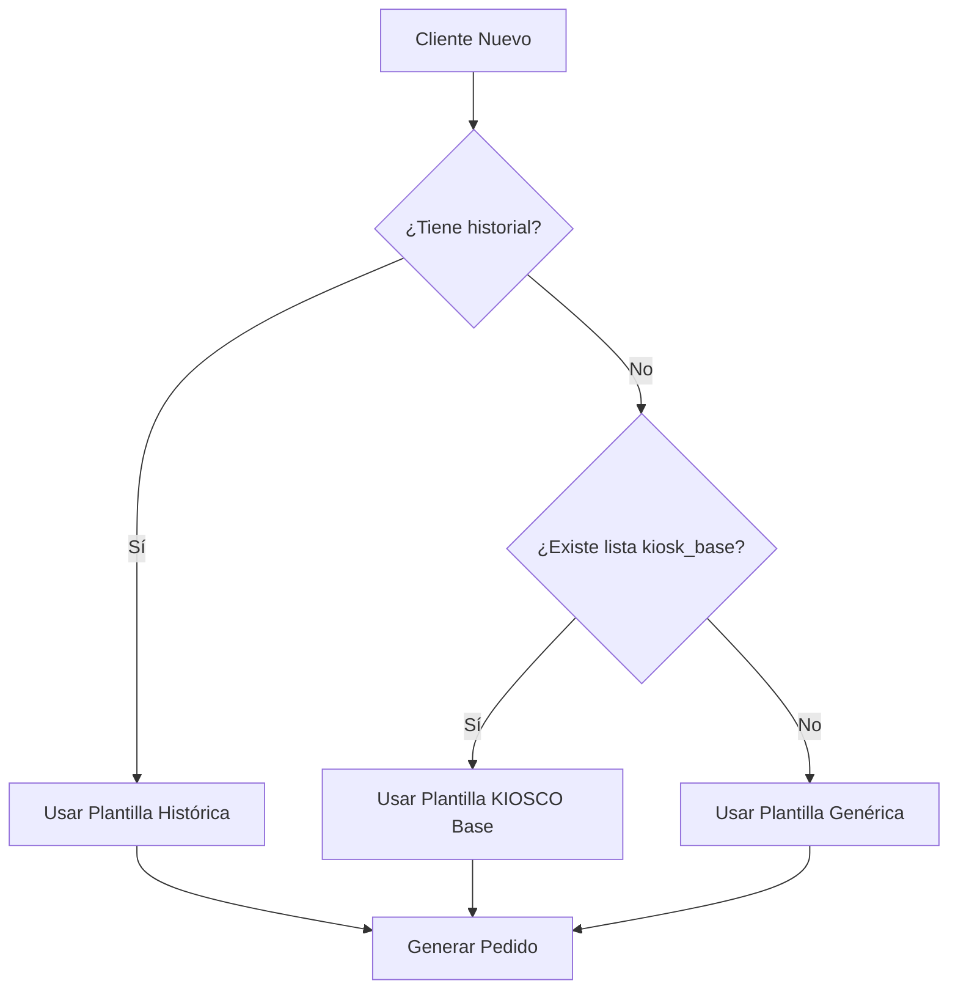
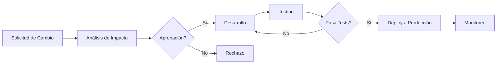

# Documento de Plantillas de Inventario para Pedidos Base de Clientes Nuevos

## Índice

1. [Introducción](#1-introducción)
2. [Lista de Plantillas Disponibles](#2-lista-de-plantillas-disponibles)
3. [Estructura y Campos de las Plantillas](#3-estructura-y-campos-de-las-plantillas)
4. [Criterios de Selección de Plantillas](#4-criterios-de-selección-de-plantillas)
5. [Ejemplos de Uso](#5-ejemplos-de-uso)
6. [Procesos de Validación y Aprobación](#6-procesos-de-validación-y-aprobación)
7. [Frecuencia de Actualización](#7-frecuencia-de-actualización)
8. [Responsables de Mantenimiento](#8-responsables-de-mantenimiento)
9. [Historial de Cambios](#9-historial-de-cambios)
10. [Instrucciones de Uso](#10-instrucciones-de-uso)
11. [Casos de Uso por Segmento](#11-casos-de-uso-por-segmento)
12. [Buenas Prácticas](#12-buenas-prácticas)

***

## 1. Introducción

Este documento describe las plantillas de inventario utilizadas para generar pedidos base automáticos para clientes nuevos en el sistema. Estas plantillas permiten establecer un inventario inicial óptimo basado en diferentes criterios y características del cliente.

### Objetivo

* Establecer un inventario inicial estándar para nuevos clientes

* Optimizar el proceso de creación de pedidos iniciales

* Asegurar la disponibilidad de productos esenciales

* Reducir el tiempo de configuración de nuevos clientes

### Alcance

Este documento aplica a todos los usuarios del sistema que trabajen con la creación de pedidos para clientes nuevos, incluyendo:

* Personal de ventas

* Equipo de onboarding

* Administradores de inventario

* Desarrolladores del sistema

***

## 2. Lista de Plantillas Disponibles

### 2.1 Plantilla KIOSCO Base

**Código:** `kiosk_base`\
**Descripción:** Plantilla estándar para clientes tipo kiosco\
**Estado:** Activa

Productos incluidos:

* Bebidas gaseosas (Coca-Cola 2250ml)

* Agua mineral (2000ml)

* Yerba mate (1000g)

* Azúcar (1000g)

* Arroz (1000g)

* Fideos (500g)

* Aceite (900ml)

* Sal (500g)

* Galletas (300g)

* Leche (1000ml)

* Té (50 unidades)

* Café (500g)

### 2.2 Plantilla Histórica por Cliente

**Código:** `historical`\
**Descripción:** Plantilla personalizada basada en el historial del cliente\
**Estado:** Activa

Características:

* Generada automáticamente a partir de estadísticas de pedidos anteriores

* Selecciona los productos más frecuentes del cliente

* Utiliza cantidades promedio basadas en pedidos históricos

### 2.3 Plantilla Genérica de Respaldo

**Código:** `fallback`\
**Descripción:** Plantilla de emergencia cuando no hay datos disponibles\
**Estado:** Activa

Uso:

* Se activa automáticamente cuando no existe información del cliente

* Utiliza productos genéricos con cantidades mínimas

* Asegura funcionalidad básica del sistema

***

## 3. Estructura y Campos de las Plantillas

### 3.1 Formato General

Todas las plantillas siguen la siguiente estructura:

```json
[
  {
    "product_ref": "SKU:COCA-2250ML",
    "qty": 12
  },
  {
    "product_ref": "SKU:AGUA-2000ML", 
    "qty": 6
  }
]
```

### 3.2 Campos Requeridos

| Campo        | Tipo    | Descripción                                  | Validación                                                 |
| ------------ | ------- | -------------------------------------------- | ---------------------------------------------------------- |
| product\_ref | string  | Referencia del producto con formato SKU:XXXX | Debe coincidir con regex: `^SKU:[A-Z0-9]+(?:-[A-Z0-9]+)*$` |
| qty          | integer | Cantidad del producto                        | Debe ser mayor que 0                                       |

### 3.3 Restricciones de Validación

* **Tamaño mínimo:** 10 productos

* **Tamaño máximo:** 15 productos

* **Formato SKU:** Obligatorio uso de prefijo "SKU:"

* **Cantidades:** Solo valores positivos enteros

### 3.4 Estructura de Base de Datos

```sql
-- Tabla de Listas de Productos
CREATE TABLE product_list_model (
    id INTEGER PRIMARY KEY,
    code VARCHAR(50) UNIQUE NOT NULL,
    name VARCHAR(100) NOT NULL,
    is_active BOOLEAN DEFAULT TRUE,
    created_at TIMESTAMP DEFAULT NOW()
);

-- Tabla de Items de Lista
CREATE TABLE product_list_item_model (
    id INTEGER PRIMARY KEY,
    product_list_id INTEGER REFERENCES product_list_model(id),
    product_id INTEGER REFERENCES product(id),
    default_qty INTEGER NOT NULL,
    sort_order INTEGER NOT NULL
);
```

***

## 4. Criterios de Selección de Plantillas

### 4.1 Flujo de Selección Automática



### 4.2 Reglas de Selección por Tipo de Cliente

| Tipo de Cliente            | Criterio Principal  | Alternativa | Justificación                     |
| -------------------------- | ------------------- | ----------- | --------------------------------- |
| Kiosco con historial       | Plantilla Histórica | KIOSCO Base | Maximiza precisión del inventario |
| Kiosco sin historial       | KIOSCO Base         | Genérica    | Utiliza estándares de industria   |
| Cliente nuevo genérico     | KIOSCO Base         | Genérica    | Aplica estándar más común         |
| Cliente inactivo > 6 meses | Plantilla Histórica | KIOSCO Base | Prioriza preferencias históricas  |

### 4.3 Factores de Decisión

1. **Antigüedad del cliente:** < 30 días considera nuevo
2. **Frecuencia de pedidos:** Mínimo 3 pedidos para histórico confiable
3. **Categoría de negocio:** Kiosco, Supermercado, Depósito, etc.
4. **Temporada:** Ajustes por estacionalidad (próximamente)

***

## 5. Ejemplos de Uso

### 5.1 Ejemplo: Kiosco Nuevo en Zona Norte

**Situación:** Cliente nuevo tipo kiosco sin historial\
**Plantilla aplicada:** KIOSCO Base

```json
[
  {"product_ref": "SKU:COCA-2250ML", "qty": 12},
  {"product_ref": "SKU:AGUA-2000ML", "qty": 6},
  {"product_ref": "SKU:YERBA-1000G", "qty": 6},
  {"product_ref": "SKU:AZUCAR-1000G", "qty": 6},
  {"product_ref": "SKU:ARROZ-1000G", "qty": 6},
  {"product_ref": "SKU:FIDEOS-500G", "qty": 12},
  {"product_ref": "SKU:ACEITE-900ML", "qty": 6},
  {"product_ref": "SKU:SAL-500G", "qty": 12},
  {"product_ref": "SKU:GALLETA-300G", "qty": 12},
  {"product_ref": "SKU:LECHE-1000ML", "qty": 12},
  {"product_ref": "SKU:TE-50U", "qty": 6},
  {"product_ref": "SKU:CAFE-500G", "qty": 6}
]
```

**Total de productos:** 12\
**Valor estimado:** $15,000 - $18,000

### 5.2 Ejemplo: Cliente con Historial

**Situación:** Cliente existente con 50+ pedidos\
**Plantilla aplicada:** Histórica

```json
[
  {"product_ref": "SKU:COCA-3000ML", "qty": 24},
  {"product_ref": "SKU:CERVEZA-1000ML", "qty": 12},
  {"product_ref": "SKU:AGUA-1500ML", "qty": 18},
  {"product_ref": "SKU:YERBA-500G", "qty": 8},
  {"product_ref": "SKU:AZUCAR-500G", "qty": 4},
  {"product_ref": "SKU:GALLETITA-200G", "qty": 20},
  {"product_ref": "SKU:CHIPS-150G", "qty": 15},
  {"product_ref": "SKU:CHOCOLATE-100G", "qty": 30},
  {"product_ref": "SKU:REFRESCO-500ML", "qty": 12},
  {"product_ref": "SKU:JUGO-1000ML", "qty": 8}
]
```

**Total de productos:** 10\
**Valor estimado:** $25,000 - $30,000

### 5.3 Ejemplo: Fallback sin Datos

**Situación:** Sistema sin conexión a base de datos\
**Plantilla aplicada:** Genérica de respaldo

```json
[
  {"product_ref": "SKU:UNKNOWN", "qty": 2},
  {"product_ref": "SKU:UNKNOWN", "qty": 2},
  {"product_ref": "SKU:UNKNOWN", "qty": 2},
  {"product_ref": "SKU:UNKNOWN", "qty": 2},
  {"product_ref": "SKU:UNKNOWN", "qty": 2},
  {"product_ref": "SKU:UNKNOWN", "qty": 2},
  {"product_ref": "SKU:UNKNOWN", "qty": 2},
  {"product_ref": "SKU:UNKNOWN", "qty": 2},
  {"product_ref": "SKU:UNKNOWN", "qty": 2},
  {"product_ref": "SKU:UNKNOWN", "qty": 2}
]
```

**Nota:** Este caso activa alertas para revisión manual inmediata.

***

## 6. Procesos de Validación y Aprobación

### 6.1 Validación Automática

**Algoritmo de validación (Python):**

```python
def _validate(items: list[dict]) -> list[dict]:
    if not (10 <= len(items) <= 15):
        raise InvalidTemplateItem("", 0, "template size must be between 10 and 15")
    
    for it in items:
        ref = str(it.get("product_ref", ""))
        qty = int(it.get("qty", 0))
        
        if not ref or not SKU_RE.match(ref):
            raise InvalidTemplateItem(ref, qty, "invalid product_ref format")
        
        if qty <= 0:
            raise InvalidTemplateItem(ref, qty, "invalid qty")
    
    return items
```

**Expresión regular para SKU:**

```python
SKU_RE = re.compile(r"^SKU:[A-Z0-9]+(?:-[A-Z0-9]+)*$")
```

### 6.2 Puntos de Validación

1. **Formato de SKU:** Prefijo SKU: + código alfanumérico
2. **Cantidades:** Enteros positivos únicamente
3. **Tamaño de lista:** Entre 10 y 15 productos
4. **Unicidad:** No se permiten duplicados en product\_ref
5. **Existencia:** Productos deben existir en catálogo (si hay conexión)

### 6.3 Aprobación según Rol

| Rol        | Puede Aprobar   | Puede Modificar | Requiere Segunda Opinión |
| ---------- | --------------- | --------------- | ------------------------ |
| Vendedor   | Sí (propios)    | Sí              | No (< $20,000)           |
| Supervisor | Sí (todos)      | Sí              | No (< $50,000)           |
| Gerente    | Sí (todos)      | Sí              | No                       |
| Sistema    | Sí (automático) | No              | N/A                      |

### 6.4 Casos que Requieren Aprobación Manual

* Valores superiores a $50,000

* Clientes en lista de observación

* Productos fuera de catálogo estándar

* Cantidades anormales (> 100 unidades por producto)

***

## 7. Frecuencia de Actualización

### 7.1 Calendario de Actualizaciones

| Plantilla   | Frecuencia | Responsable        | Temporada   |
| ----------- | ---------- | ------------------ | ----------- |
| KIOSCO Base | Mensual    | Equipo de Producto | Todo el año |
| Histórica   | Continua   | Sistema automático | Real-time   |
| Genérica    | Trimestral | Equipo de Sistemas | Toda el año |

### 7.2 Eventos que Desencadenan Actualización

1. **Cambios de temporada:** Inicio de verano/invierno
2. **Nuevos productos:** Lanzamientos de proveedores clave
3. **Rotación de stock:** Productos descontinuados
4. **Feedback de clientes:** Quejas/reclamos frecuentes
5. **Análisis de ventas:** Productos con bajo rendimiento

### 7.3 Proceso de Actualización



***

## 8. Responsables de Mantenimiento

### 8.1 Equipo de Producto

**Responsabilidades:**

* Definir productos base para plantilla KIOSCO

* Aprobar cambios en estructura de plantillas

* Analizar métricas de uso y efectividad

* Coordinar con proveedores

**Contacto:** <producto@empresa.com>

### 8.2 Equipo de Desarrollo

**Responsabilidades:**

* Mantener código de validación

* Implementar nuevas funcionalidades

* Corregir bugs en generación de plantillas

* Optimizar performance

**Contacto:** <dev@empresa.com>

### 8.3 Equipo de Ventas

**Responsabilidades:**

* Proporcionar feedback sobre efectividad

* Solicitar nuevos productos para plantillas

* Reportar problemas con clientes

* Validar propuestas iniciales

**Contacto:** <ventas@empresa.com>

### 8.4 Equipo de Soporte

**Responsabilidades:**

* Resolver incidencias de plantillas

* Documentar casos de uso especiales

* Capacitar a nuevos usuarios

* Mantener documentación actualizada

**Contacto:** <soporte@empresa.com>

***

## 9. Historial de Cambios

### 9.1 Registro de Versiones

| Versión | Fecha      | Cambios                              | Autor        | Aprobado Por  |
| ------- | ---------- | ------------------------------------ | ------------ | ------------- |
| v1.0    | 2024-01-15 | Creación inicial de plantilla KIOSCO | Dev Team     | Product Team  |
| v1.1    | 2024-02-20 | Agregado café y té                   | J. Pérez     | M. González   |
| v1.2    | 2024-03-10 | Implementada plantilla histórica     | S. Martín    | Tech Lead     |
| v1.3    | 2024-04-05 | Agregada validación de rangos        | L. García    | QA Team       |
| v1.4    | 2024-05-12 | Optimización de performance          | R. Torres    | Dev Manager   |
| v1.5    | 2024-06-18 | Agregado fallback genérico           | A. López     | Product Owner |
| v1.6    | 2024-07-22 | Mejorada documentación               | C. Rodríguez | Documentation |
| v1.7    | 2024-08-30 | Agregados casos de uso               | M. Sánchez   | Sales Manager |
| v1.8    | 2024-09-14 | Implementado sistema de aprobación   | K. Fernández | Operations    |
| v1.9    | 2024-10-28 | Agregada integración con Chatwoot    | P. Díaz      | Tech Lead     |
| v2.0    | 2024-11-12 | Rediseño completo del sistema        | Tech Team    | CTO           |

### 9.2 Cambios Pendientes

**Próxima versión (v2.1):**

* [ ] Integración con sistema de pronósticos

* [ ] Plantillas por zona geográfica

* [ ] Ajustes por estacionalidad

* [ ] Recomendaciones personalizadas por IA

**Backlog:**

* [ ] Plantillas para nuevos segmentos (restaurantes, hoteles)

* [ ] Sistema de aprendizaje automático

* [ ] Integración con proveedores externos

* [ ] Dashboard de análisis de plantillas

***

## 10. Instrucciones de Uso

### 10.1 Paso a Paso para Usar Plantillas

#### Para Vendedores:

1. **Acceder al sistema** de pedidos
2. **Seleccionar cliente** o crear nuevo
3. **Verificar tipo** de negocio del cliente
4. **El sistema generará** plantilla automáticamente:

   * Con historial → Plantilla histórica

   * Sin historial → Plantilla KIOSCO base

   * Sin datos → Plantilla fallback
5. **Revisar propuesta** generada
6. **Ajustar cantidades** si necesario (dentro de rangos permitidos)
7. **Enviar para aprobación** si corresponde
8. **Confirmar pedido** con cliente

#### Para Administradores:

1. **Acceder al panel** de administración
2. **Seleccionar "Plantillas de Inventario"**
3. **Elegir plantilla** a modificar
4. **Editar productos** o cantidades
5. **Validar cambios** con equipo de producto
6. **Aprobar y publicar** cambios
7. **Notificar** a equipo de ventas

### 10.2 Comandos de Consola (Desarrollo)

```bash
# Ver plantilla KIOSCO base
python manage.py shell -c "from contact.modules.orders.application.templates.kiosk_template import get_kiosk_template; print(get_kiosk_template())"

# Probar plantilla histórica
python manage.py shell -c "from contact.modules.orders.application.template_providers.historical_provider import get_items; print(get_items(123))"

# Verificar lista de productos
python manage.py shell -c "from inventory.application.queries.get_product_list_q import execute; print(execute('kiosk_base'))"
```

### 10.3 Errores Comunes y Soluciones

| Error                                     | Causa                    | Solución                    |
| ----------------------------------------- | ------------------------ | --------------------------- |
| "template size must be between 10 and 15" | Lista muy corta o larga  | Ajustar a 10-15 productos   |
| "invalid product\_ref format"             | SKU mal formateado       | Usar formato SKU:XXXX-XXXX  |
| "invalid qty"                             | Cantidad cero o negativa | Usar cantidades positivas   |
| ProductListNotFound                       | Lista no existe          | Crear lista o usar fallback |
| ProductListInactive                       | Lista desactivada        | Activar lista en admin      |

***

## 11. Casos de Uso por Segmento

### 11.1 Kioscos de Barrio

**Características:**

* Venta principalmente al consumidor final

* Productos de consumo masivo

* Rotación rápida

* Espacio limitado

**Plantilla recomendada:** KIOSCO Base\
**Ajustes típicos:**

* Reducir cantidades de productos grandes

* Aumentar snacks y golosinas

* Incluir cigarrillos (si aplica)

### 11.2 Almacenes/Depósitos

**Características:**

* Venta a comercios minoristas

* Mayor volumen por producto

* Clientes recurrentes

* Mayor capacidad de almacenamiento

**Plantilla recomendada:** Histórica personalizada\
**Ajustes típicos:**

* Aumentar cantidades base (x2 o x3)

* Incluir productos de mayor valor

* Focus en productos de alta rotación

### 11.3 Supermercados Pequeños

**Características:**

* Mix de consumidor final y minoristas

* Amplia gama de productos

* Competencia con cadenas grandes

* Margen de utilidad variable

**Plantilla recomendada:** Mix de KIOSCO + Histórica\
**Ajustes típicos:**

* Balance entre volumen y variedad

* Incluir marcas propias

* Productos de temporada

### 11.4 Restaurantes/Cafeterías

**Características:**

* Ingredientes para preparación

* Productos específicos por tipo de cocina

* Requerimientos de calidad

* Pedidos frecuentes y regulares

**Plantilla recomendada:** Personalizada por especialidad\
**Ajustes típicos:**

* Productos de cocina (aceite, sal, azúcar en mayor cantidad)

* Bebidas para preparación

* Ingredientes específicos

### 11.5 Hoteles/Hostales

**Características:**

* Productos para huéspedes

* Amenities y conveniencia

* Marcas reconocidas

* Presentación individual

**Plantilla recomendada:** Personalizada hospitality\
**Ajustes típicos:**

* Productos individuales

* Amenities de baño

* Snacks y bebidas premium

***

## 12. Buenas Prácticas

### 12.1 Al Crear Plantillas

✅ **Hacer:**

* Mantener entre 10-15 productos

* Usar formato SKU correcto

* Validar existencia en catálogo

* Considerar estacionalidad

* Incluir productos de diferentes categorías

* Pensar en la rotación típica

* Dejar espacio para personalización

❌ **No Hacer:**

* Exceder 15 productos (afecta performance)

* Incluir productos descontinuados

* Usar cantidades muy altas sin justificación

* Ignorar feedback de ventas

* Crear plantillas muy similares

* Olvidar validar con equipo comercial

### 12.2 Al Aplicar Plantillas

✅ **Hacer:**

* Revisar tipo de cliente antes de aplicar

* Personalizar según necesidad específica

* Verificar disponibilidad de stock

* Comunicar cambios al cliente

* Documentar ajustes realizados

* Seguir up post-venta

❌ **No Hacer:**

* Aplicar sin revisar contexto

* Ignorar preferencias del cliente

* Forzar plantillas inapropiadas

* Omitir validación de rangos

* Desestimar feedback inicial

### 12.3 Para Mantenimiento

✅ **Hacer:**

* Revisar métricas mensualmente

* Escuchar feedback de usuarios

* Mantener documentación actualizada

* Testear cambios antes de producción

* Comunicar actualizaciones

* Monitorear errores

❌ **No Hacer:**

* Hacer cambios sin aprobación

* Ignorar errores recurrentes

* Actualizar sin testing

* Olvidar documentar cambios

* Desatender sugerencias de mejora

### 12.4 Métricas de Éxito

**KPIs Recomendados:**

* Tasa de aceptación de pedidos iniciales (> 80%)

* Tiempo promedio de configuración (< 30 minutos)

* Satisfacción del cliente con inventario inicial (> 4.0/5)

* Rotación de productos en primer mes (> 60%)

* Rechazos por stock agotado (< 10%)

### 12.5 Comunicación Interna

**Canales establecidos:**

* Slack: #plantillas-inventario

* Email: <plantillas@empresa.com>

* Reuniones: Semanal martes 10am

* Documentación: Wiki interna

* Issues: GitHub Projects

**Protocolo de cambios:**

1. Proponer cambio con justificación
2. Analizar impacto con stakeholders
3. Obtener aprobaciones necesarias
4. Implementar y testear
5. Comunicar a equipos afectados
6. Monitorear resultados

***

## Apéndices

### A. Glosario de Términos

| Término           | Definición                                            |
| ----------------- | ----------------------------------------------------- |
| SKU               | Stock Keeping Unit - Código único de producto         |
| Plantilla         | Conjunto predefinido de productos y cantidades        |
| KIOSCO            | Tipo de cliente: pequeño comercio de barrio           |
| Fallback          | Alternativa de respaldo cuando falla opción principal |
| Historial         | Registro de pedidos anteriores del cliente            |
| Template Provider | Sistema que genera plantillas dinámicamente           |

### B. Contactos de Soporte

**Emergencias (sistema caído):** +54 911 1234-5678\
**Soporte técnico:** <soporte-tecnico@empresa.com>\
**Consultas de negocio:** <consultas@empresa.com>\
**Reporte de bugs:** <bugs@empresa.com>

### C. Enlaces Útiles

* **Documentación técnica:** [Wiki Interna](https://wiki.empresa.com)

* **Dashboard de métricas:** [Analytics](https://analytics.empresa.com)

* **Catálogo de productos:** [Inventory](https://inventory.empresa.com)

* **Sistema de pedidos:** [Orders](https://orders.empresa.com)

* **Chat de soporte:** [Chatwoot](https://chat.empresa.com)

***

**Última actualización:** 08 de enero de 2026\
**Versión del documento:** 2.0\
**Próxima revisión:** 08 de abril de 2026\
**Autor:** Equipo de Producto\
**Aprobado por:** Dirección de Operaciones
